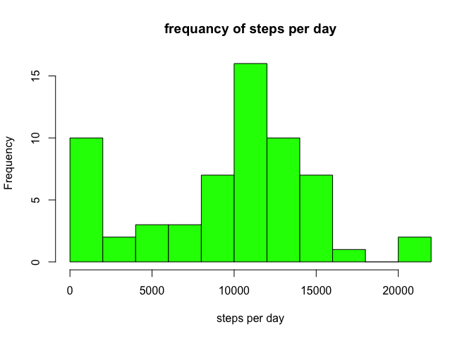
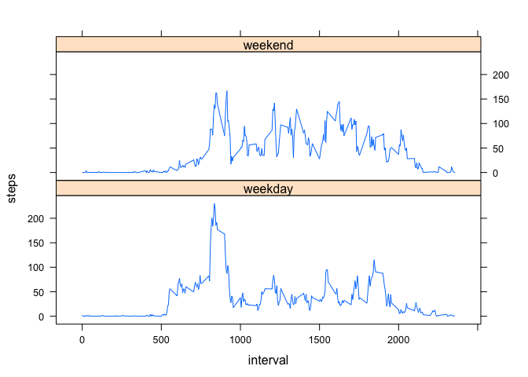

# Reproducible Research: Peer Assessment 1


## Loading and preprocessing the data

```r
## reading file 
#unzip("activity.zip", overwrite = FALSE, exdir = "figure")
initActiv <- read.csv("figure/activity.csv")    

## adding new useful dimensions ##
initActiv$hour <- floor(initActiv$interval / 60)
initActiv$minute <- initActiv$interval - initActiv$hour*60
initActiv$datetime <- as.POSIXlt(
    paste(initActiv$date, initActiv$hour, initActiv$minute, sep = " "), 
    format = "%Y-%m-%d %H %M")    
```
## What is mean total number of steps taken per day?

```r
steps_daily <- tapply(initActiv$steps, initActiv$date, sum, na.rm = TRUE)

mean(steps_daily)
```

```
## [1] 9354.23
```

```r
median(steps_daily)
```

```
## [1] 10395
```

```r
hist(steps_daily, breaks = 10, col = "green", xlab = "steps per day", 
     main = "frequancy of steps per day")
```

 


## What is the average daily activity pattern?

```r
steps_5min <- tapply(initActiv$steps, initActiv$interval, mean, na.rm = TRUE)

plot(y = steps_5min, x = names(steps_5min), type = "l")
```

 

```r
names(steps_5min)[steps_5min == max(steps_5min)]
```

```
## [1] "835"
```


## Imputing missing values


## Are there differences in activity patterns between weekdays and weekends?
