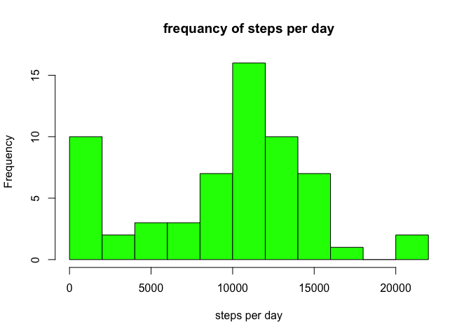
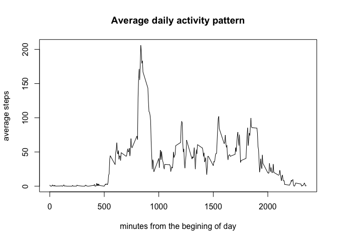
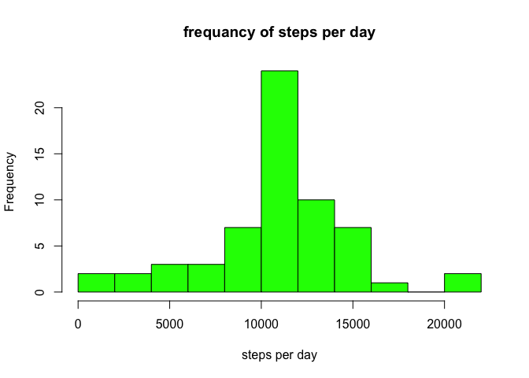

# Reproducible Research: Peer Assessment 1


## Loading and preprocessing the data

```r
## reading file 
#unzip("activity.zip", overwrite = FALSE, exdir = "figure")
initActiv <- read.csv("figure/activity.csv")    

## adding new useful dimensions ##
initActiv$hour <- floor(initActiv$interval / 60)
initActiv$minute <- initActiv$interval - initActiv$hour*60
initActiv$datetime <- as.POSIXlt(
    paste(initActiv$date, initActiv$hour, initActiv$minute, sep = " "), 
    format = "%Y-%m-%d %H %M")
initActiv$date <- as.Date(initActiv$date)
```
## What is mean total number of steps taken per day?

```r
steps_daily <- tapply(initActiv$steps, initActiv$date, sum, na.rm = TRUE)

mean(steps_daily)
```

```
## [1] 9354.23
```

```r
median(steps_daily)
```

```
## [1] 10395
```

```r
hist(steps_daily, breaks = 10, col = "green", xlab = "steps per day", 
     main = "frequancy of steps per day")
```

 


## What is the average daily activity pattern?

```r
steps_5m<- tapply(initActiv$steps, initActiv$interval, mean, na.rm = TRUE)

plot(y = steps_5m, x = names(steps_5m), type = "l",
    xlab = "minutes from the begining of day",
    ylab = "average steps",
    main = "Average daily activity pattern")
```

 


```r
max_steps_val <- max(steps_5m)
max_steps_period <- as.integer(names(steps_5m)[steps_5m == max_steps_val])
```
The most active period is between 835 and 
840 minutes from the beginig of day. 
Average steps in this period are 206.17


## Imputing missing values
I'll use average steps in every 5 minutes interval to fill missed values  

```r
new_active <- initActiv
sum(is.na(new_active$steps))
```

```
## [1] 2304
```

```r
new_active$steps[is.na(new_active$steps)] <- as.integer(steps_5m[as.character(new_active$interval[is.na(new_active$steps)])])
sum(is.na(new_active$steps))
```

```
## [1] 0
```

```r
new_steps_daily <- tapply(new_active$steps, new_active$date, sum, na.rm = TRUE)

mean(new_steps_daily)
```

```
## [1] 10749.77
```

```r
median(new_steps_daily)
```

```
## [1] 10641
```

```r
hist(new_steps_daily, breaks = 10, col = "green", xlab = "steps per day", 
     main = "frequancy of steps per day")
```

 

After filling missed values, both mean and median become higher.

## Are there differences in activity patterns between weekdays and weekends?


```r
new_active$weekday <- weekdays(new_active$date)
new_active$is_weekend <- "weekday"
new_active$is_weekend[new_active$weekday %in% c("Saturday", "Sunday")] <- "weekend"

x <- as.data.frame(tapply(new_active$steps, new_active[, c("interval", "is_weekend")], mean))
x$interval <- as.numeric(rownames(x))
x <- melt(x, id = c("interval"), measure.vars = c("weekday", "weekend"))
names(x) <- c("interval", "is_weekend", "steps")
xyplot(steps ~ interval | is_weekend, data = x, type = "a", layout = c(1, 2))
```

 

